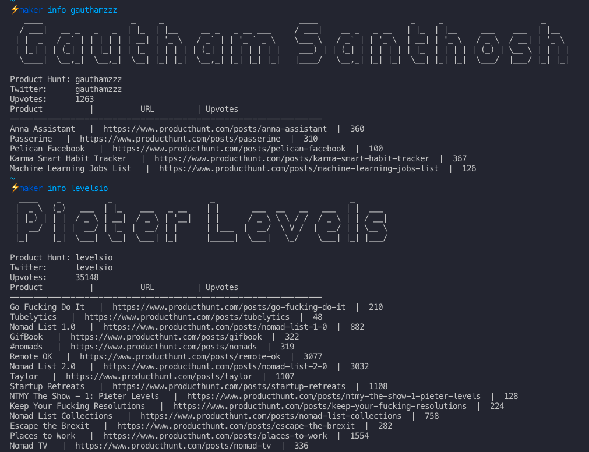

# Maker CLI 



## Install

`go get github.com/gauthamzz/maker`

## Usage

```
Commad line tool about Makers
.___  ___.      ___       __  ___  _______ .______      
|   \/   |     /   \     |  |/  / |   ____||   _  \     
|  \  /  |    /  ^  \    |  '  /  |  |__   |  |_)  |    
|  |\/|  |   /  /_\  \   |    <   |   __|  |      /     
|  |  |  |  /  _____  \  |  .  \  |  |____ |  |\  \----.
|__|  |__| /__/     \__\ |__|\__\ |_______|| _| ._____|
                                                        

Usage:
  maker [command]

Available Commands:
  help        Help about any command
  info        Info about maker

Flags:
  -h, --help   help for maker

Use "maker [command] --help" for more information about a command.
```

